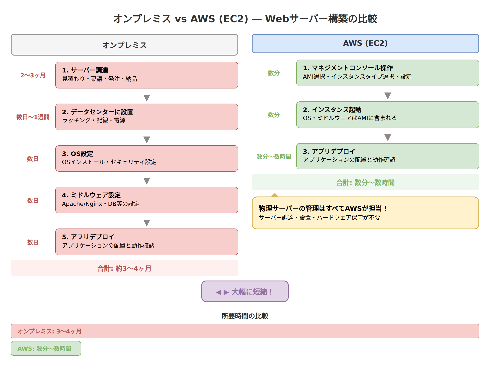
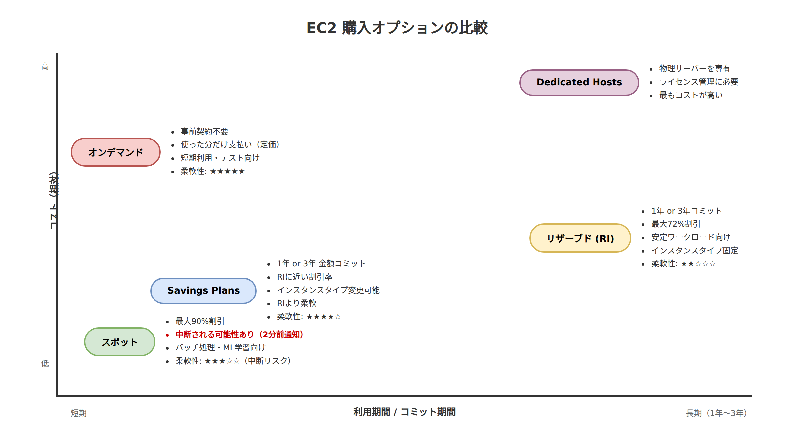
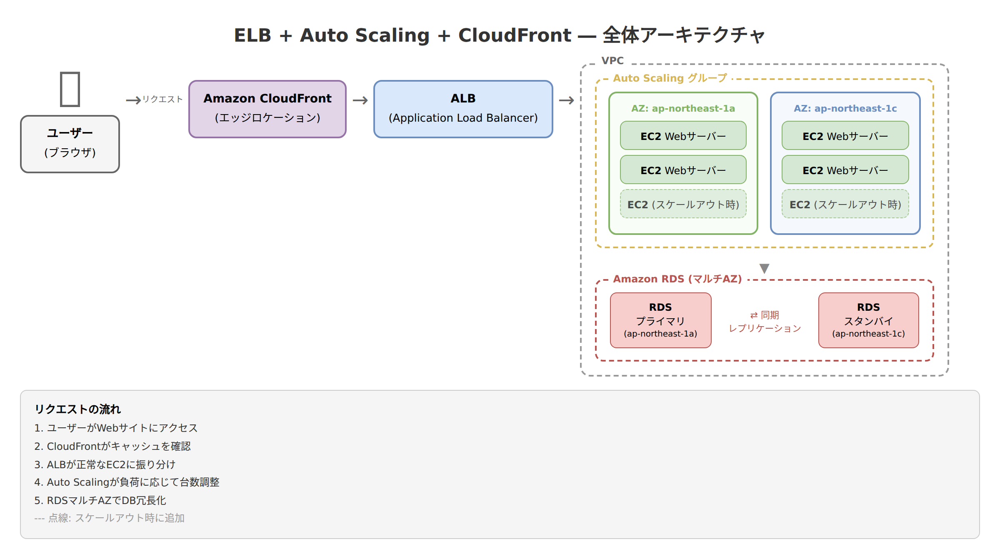

# 第1章　Webアプリケーションのホスティング

**対応試験ドメイン**: 第3分野: クラウドテクノロジーとサービス（34%）、第1分野: クラウドのコンセプト（24%）
**推定読了時間**: 40分

---

## この章で学ぶこと

自分のWebサイトやWebアプリケーションを公開するには、サーバーが必要です。この章では「サーバーをどうやって用意するか」という課題からスタートし、AWSのさまざまなサービスを使って解決していく流れを学びます。

- オンプレミスでサーバーを用意することの大変さ
- Amazon EC2 による仮想サーバーの利用
- EC2 の購入オプションによるコスト最適化
- Elastic Load Balancing による負荷分散
- Auto Scaling によるサーバー台数の自動調整
- Amazon Lightsail と Elastic Beanstalk による簡易ホスティング
- Amazon CloudFront による高速なコンテンツ配信

---

## 1-1. オンプレミスでWebサーバーを立てるとどうなるか

### このセクションで学ぶこと

クラウドが登場する前の「当たり前」を知ることで、「なぜクラウドが必要なのか」を実感します。

### Webサイト公開までの長い道のり

あなたはネットショップを始めたいとします。お客さんがブラウザからアクセスできるWebサイトを作るには、まずサーバーが必要です。クラウドが普及する前は、次のような手順を踏むのが一般的でした。

まず、物理サーバーの調達です。サーバー本体を購入し、データセンターに設置する必要があります。サーバーの見積もり、稟議、発注、納品、設置——ここまでで2〜3ヶ月かかることも珍しくありません。初期費用は最低でも100万円以上。高性能なサーバーを複数台そろえると、数千万円になることもあります。

次に、OSやソフトウェアのインストールです。届いたサーバーにOSをインストールし、Webサーバーソフト（ApacheやNginxなど）を設定し、セキュリティの設定をし……と、専門的な作業が続きます。

さらに、運用中にハードウェアが故障したら、自分たちで修理や交換の手配をしなければなりません。深夜であっても、休日であっても、です。

### 突然のアクセス急増に対応できない

前項の例の続きです。無事にWebサイトを公開出来ました。ネットショップがテレビで紹介されて、アクセスが10倍になったとしましょう。オンプレミス（自社でサーバーを持つ運用形態）の場合、サーバーの処理能力を超えてしまうと、サイトが遅くなったり落ちたりします。サーバーを追加するにも、調達に数週間〜数ヶ月かかります。そのころにはブームは去っているかもしれません。

逆に、アクセスが減ったとしても、購入したサーバーは返品できません。使わなくても維持費はかかり続けます。

このように、オンプレミスには「初期コストが高い」「構築に時間がかかる」「需要変動に対応しにくい」という3つの大きな課題があります。

> **図解:** オンプレミス vs クラウドのWebサーバー比較図
> 

---

> **試験のポイント**
> - オンプレミスの課題として「大きな初期投資（CapEx）」「調達リードタイム」「需要変動への対応困難」を覚える
> - クラウドは「従量課金（OpEx）」「数分での構築」「弾力性（Elasticity）」でこれらを解決する
> - 第0章で学んだ「CapExからOpExへの移行」が、具体的にどういう場面で効いてくるかを意識する

---

## 1-2. Amazon EC2 の基本

### このセクションで学ぶこと

AWSの中核サービスであるAmazon EC2（仮想サーバー）の基本概念を理解します。

### EC2とは何か

Amazon EC2（Elastic Compute Cloud）は、AWSが提供するレンタルサーバーのようなサービスです。「レンタルサーバー」といっても、物理的なサーバーそのものを借りるわけではありません。物理サーバーの上に「仮想マシン」（パソコンの中に仮想的に作られた、もう一台のパソコンのようなもの）を作り、それを1台単位で借りる仕組みです。1台の高性能な物理サーバーを専用のソフトウェアで区切って、複数の仮想サーバーとして利用します。マンションの1フロアをパーティションで区切って複数の部屋にするイメージです。この仮想マシン1台のことを「インスタンス」と呼びます。

EC2の大きな特徴は、必要なときに数分で起動でき、不要になったらすぐに停止・削除できることです。サーバーの調達に数ヶ月かかるオンプレミスとは、まったく違うスピード感です。

### AMI ― サーバーの「設計図」

EC2インスタンスを起動するときには、AMI（Amazon Machine Image）を選びます。AMIは、サーバーの「設計図」や「テンプレート」のようなものです。

AMIには、OSの種類（Amazon Linux、Windows Serverなど）と、あらかじめインストールされたソフトウェアの情報が含まれています。たとえば「WordPressがすでにセットアップ済みのAMI」を使えば、起動するだけですぐにブログを始められます。

AMIには3つの種類があります。AWSが公式に用意しているもの、AWSマーケットプレイスで他のベンダーが提供しているもの、そして自分でカスタマイズして作成したものです。自分で作ったAMIを「カスタムAMI」と呼び、同じ構成のサーバーを素早く何台でも立ち上げたいときに便利です。

### インスタンスタイプ ― サーバーの「スペック」を選ぶ

EC2では、用途に応じてサーバーのスペック（CPUやメモリの量）を自由に選べます。これが「インスタンスタイプ」です。

インスタンスタイプの名前は `m5.xlarge` のような形式になっています。先頭の文字がファミリー（用途のカテゴリ）、数字が世代、ドットの後がサイズ（スペックの大きさ）を表します。

主なインスタンスファミリーを見てみましょう。

汎用（t系、m系）は、CPUとメモリのバランスがとれたタイプです。Webサーバーや小規模なアプリケーションなど、幅広い用途に使えます。特にt系は「バースト」という特徴を持っていて、普段は控えめな性能で動きつつ、一時的に高い性能を発揮できます。小さなWebサイトや開発・検証環境に向いています。

コンピューティング最適化（c系）は、CPUの処理能力を重視したタイプです。大量の計算処理やバッチ処理に向いています。

メモリ最適化（r系、x系）は、大きなメモリを搭載したタイプです。大量のデータをメモリ上で処理するデータベースサーバーなどに向いています。

ストレージ最適化（i系、d系）は、高速なディスクI/O（読み書き性能）を重視したタイプです。大量のデータを読み書きするデータウェアハウスに向いています。

試験では個々のインスタンスタイプの細かなスペックは問われません。「t系やm系は汎用」「c系はコンピューティング最適化」といった大まかな分類を覚えておけば十分です。

### Elastic IP ― 固定のIPアドレス

通常、EC2インスタンスには起動のたびに異なるパブリックIPアドレス（インターネット上の住所）が割り当てられます。これでは、サーバーを再起動するたびにアドレスが変わってしまい不便です。

Elastic IPは、インスタンスを停止・再起動しても変わらない固定のパブリックIPアドレスです。Webサイトのように「いつも同じアドレスでアクセスしたい」場合に使います。

ここで1つ重要な注意点があります。Elastic IPは、EC2インスタンスに関連付けて使っている間は無料ですが、どのインスタンスにも関連付けずに放置していると料金が発生します。AWSは限りあるIPアドレスを無駄に確保されることを防ぐため、「使わないなら解放してください」という仕組みにしているのです。この「未使用のElastic IPは課金対象」という点は、試験でも問われることがあります。

### EBS ― サーバーの「ハードディスク」

EC2インスタンスにはデータを保存するためのストレージ（記憶装置）が必要です。Amazon EBS（Elastic Block Store）は、EC2インスタンスに取り付ける仮想的なハードディスクのようなサービスです。

EBSの特徴は、インスタンスを停止してもデータが消えないことです。また、インスタンスから取り外して別のインスタンスに付け替えることもできます。USBの外付けハードディスクのようなイメージです。

EBSの詳しい種類や使い方は第3章（ストレージサービス）で改めて説明しますので、ここでは「EC2のデータ保存にはEBSを使う」ということを覚えておいてください。

### セキュリティグループ、キーペア、ユーザーデータ

EC2にはほかにも知っておくべき基本要素があります。

まず「セキュリティグループ」です。これはEC2インスタンスに設定するファイアウォール（通信の出入りを制御する仕組み）のことで、どの通信を許可するかをルールで定義します。たとえば「Webブラウザからのアクセス（ポート80/443）は許可するが、それ以外は拒否する」といった設定ができます。セキュリティグループの詳しい仕組みは第5章で学びます。

次に「キーペア」です。EC2インスタンスにリモートで接続するには、キーペア（公開鍵と秘密鍵のペア）を使います。家の鍵と同じように、秘密鍵を持っている人だけがサーバーにログインできる仕組みです。

最後に「ユーザーデータ」です。EC2インスタンスの起動時に自動実行されるスクリプト（命令書）を設定できます。たとえば「起動したら自動的にWebサーバーソフトをインストールして設定する」といった処理を自動化できます。AMIがサーバーの「設計図」だとすれば、ユーザーデータは起動後に実行される「初期セットアップの手順書」のようなものです。

---

> **試験のポイント**
> - EC2 = IaaS（OSより上は顧客が管理）
> - AMI = サーバーのテンプレート（OS + ソフトウェアの構成情報）
> - インスタンスファミリーの大まかな分類: t/m=汎用、c=コンピューティング最適化、r=メモリ最適化、i/d=ストレージ最適化
> - Elastic IPは未使用時に課金される
> - EBSはEC2用の永続的なブロックストレージ（詳細は第3章）
> - セキュリティグループ = EC2のファイアウォール（詳細は第5章）
> - ユーザーデータ = インスタンス起動時に自動実行されるスクリプト

---

## 1-3. EC2 の購入オプション

### このセクションで学ぶこと

EC2には、利用目的や予算に応じたさまざまな料金プランがあります。ここでは各プランの特徴と使い分けを学びます。このセクションは試験で非常によく出題されます。

### オンデマンドインスタンス

最も基本的な購入オプションです。使った時間だけ料金を支払います。事前の契約や前払いは不要です。

ホテルの当日予約と同じイメージです。いつでも泊まれますが、料金は定価です。短期間のテストや、需要が予測できないワークロードに向いています。

### リザーブドインスタンス（RI）

1年間または3年間の利用を事前に約束（コミット）することで、オンデマンドに比べて最大72%の割引を受けられるプランです。

年間契約のスマホ料金プランに似ています。長く使い続ける前提で契約するので、月々の料金が安くなります。ただし、途中で不要になっても契約期間中は支払いが続きます。常時稼働するデータベースサーバーなど、利用量が安定しているワークロードに向いています。

支払い方法には「全前払い」「一部前払い」「前払いなし」の3種類があり、前払い額が多いほど割引率が高くなります。

なお、リザーブドインスタンスには「スタンダード」と「コンバーティブル」の2種類があります。スタンダードRIは割引率が高い代わりに、契約したインスタンスタイプを変更できません。コンバーティブルRIは期間中にインスタンスタイプを変更できますが、その分スタンダードRIより割引率は低くなります。将来的にサーバーのスペックを変えるかもしれない場合は、コンバーティブルRIが安心です。

### Savings Plans

リザーブドインスタンスと同じく、1年または3年の利用をコミットするプランです。ただし、リザーブドインスタンスが「特定のインスタンスタイプ」を固定するのに対し、Savings Plansは「1時間あたりの利用金額」をコミットするだけなので、インスタンスタイプやリージョンを柔軟に変更できます。

「月5万円分は必ず使います」と約束する代わりに割引を受ける、携帯電話の定額プランのようなものです。どの機種（インスタンスタイプ）に使うかは自由に決められます。割引率はリザーブドインスタンスと同程度（最大72%）ですが、インスタンスタイプを柔軟に変更できる点がメリットです。

なお、Azureにも「Reserved VM Instances」、GCPにも「Committed Use Discounts（CUD）」という類似の仕組みがあります。ただし、金額ベースでコミットして柔軟にリソースを変更できるSavings Plansの仕組みはAWS独自の特徴です。

### スポットインスタンス

AWSが余らせているサーバー容量を、最大90%の大幅割引で利用できるプランです。ただし、大きな注意点があります。AWSの都合で、2分前の通知で中断されることがあるのです。

バーゲンセールの目玉商品に近いイメージです。とても安いですが、品切れになったら返さなければなりません。そのため、途中で中断されても問題ないワークロードに限って使います。具体的には、大量データのバッチ処理、機械学習のトレーニング、テスト環境などが適しています。

「スポットインスタンスは中断される可能性がある」——これは試験で非常によく問われるポイントです。

### Dedicated Hosts（専有ホスト）

物理サーバー1台をまるごと自分専用に確保するオプションです。他のAWSユーザーと物理サーバーを共有しません。

ライセンスの制約でサーバーのCPU数やソケット数を把握する必要がある場合や、法規制によりサーバーの共有が許されない場合に使います。料金は最も高額です。

ここで注意が必要なのが、Dedicated Instances（専有インスタンス）との違いです。Dedicated Instancesも他のユーザーと物理サーバーを共有しない点は同じですが、「どの物理サーバーで動くか」を管理者がコントロールすることはできません。Dedicated Hostsは物理サーバー単位で確保するため、サーバーのCPU構成まで把握でき、ソフトウェアライセンスの管理に適しています。試験ではこの違いが引っかけ問題として出ることがあります。

具体的な金額のイメージを持っておくと理解が深まります。たとえば、オンデマンドで月額1,000ドルかかるサーバーの場合、リザーブドインスタンス（3年、全前払い）なら月額約280ドル相当、スポットインスタンスなら月額約100〜300ドル相当で利用できます。Savings Plansもリザーブドインスタンスと同程度の割引が得られます。どのオプションを選ぶかは、ワークロードの特性と予算に応じて判断します。

> **図解:** EC2購入オプションの比較チャート
> 

---

> **試験のポイント**
> - オンデマンド = 定価、事前契約なし、短期利用向け
> - リザーブド = 1年or3年コミット、最大72%割引、安定ワークロード向け
> - スタンダードRIは割引率が高いがタイプ変更不可。コンバーティブルRIはタイプ変更可能だが割引率は低め
> - Savings Plans = 金額コミット、インスタンスタイプ変更可能、柔軟性が高い（割引率はRIと同程度）
> - スポット = 最大90%割引、ただし中断リスクあり
> - Dedicated Hosts = 物理サーバー確保、ライセンス管理向け
> - Dedicated Hosts と Dedicated Instances の違いを押さえる

---

## 1-4. Elastic Load Balancing

### このセクションで学ぶこと

複数のサーバーにアクセスを分散させる「ロードバランサー」の仕組みと、AWSが提供するELBの種類を理解します。

### なぜ負荷分散が必要か

Webサイトへのアクセスが増えてくると、サーバー1台では処理しきれなくなります。そこで、サーバーを複数台用意して、アクセスを分散させるのが「負荷分散」です。

レジが1台しかないお店を想像してください。お客さんが増えるとレジに長い行列ができます。レジを3台に増やして、それぞれのレジにお客さんを振り分ける——この「振り分け役」がロードバランサーです。

### ELBの種類

Elastic Load Balancing（ELB）は、AWSが提供するマネージド型（AWS側が運用管理する）のロードバランサーサービスです。3つの種類があります。

ALB（Application Load Balancer）は、HTTP/HTTPSの通信を処理するロードバランサーです。通信の内容（URLのパスやホスト名など）を見て、振り分け先を細かく制御できます。Webアプリケーションの負荷分散に最も一般的に使われます。ネットワーク通信の階層でいうと「レイヤー7」（アプリケーション層）で動作します。レイヤー7とは、WebブラウザやアプリケーションがやりとりするHTTPなどの通信レベルのことです。通信の階層については付録Aで詳しく解説しています。

NLB（Network Load Balancer）は、TCP/UDP（インターネット通信の基盤となるプロトコル）レベルの通信を処理するロードバランサーです。「レイヤー4」（トランスポート層）で動作し、レイヤー7より一段低い通信レベルを扱うため、非常に高速かつ大量の接続を処理できます。ゲームサーバーやIoTデバイスとの通信など、極めて高い性能が求められる場面に向いています。

CLB（Classic Load Balancer）は旧世代のロードバランサーです。レイヤー4とレイヤー7の両方に対応していますが、ALBやNLBほどの機能はありません。新規の利用は推奨されておらず、既存システムの互換性のために残されています。

試験で問われるのは、主にALBとNLBの使い分けです。「HTTPの負荷分散ならALB」「高速なTCP通信ならNLB」と覚えておきましょう。AWSではこのようにロードバランサーがALB・NLB・CLBと明確に分かれていますが、GCPではCloud Load Balancingとして統合されており、AzureではApplication GatewayがALB、Azure Load BalancerがNLBにそれぞれ近い位置づけです。

### ヘルスチェック

ELBには「ヘルスチェック」という重要な機能があります。ロードバランサーが定期的に各サーバーに「元気ですか？」と問い合わせ、応答がないサーバーには新しいリクエストを送らないようにする仕組みです。

これにより、1台のサーバーが故障しても、残りの正常なサーバーだけにアクセスが振り分けられるため、ユーザーはサイトが落ちたことに気づかずに済みます。

---

> **試験のポイント**
> - ALB = HTTP/HTTPS（レイヤー7）、Webアプリ向け
> - NLB = TCP/UDP（レイヤー4）、高性能・低遅延
> - CLB = 旧世代、新規利用は非推奨
> - ヘルスチェック = 正常なインスタンスにのみトラフィックを振り分ける

---

## 1-5. Auto Scaling

### このセクションで学ぶこと

需要の変動に応じてサーバーの台数を自動的に増減させる「Auto Scaling」の仕組みを理解します。

### スケーリングの2つの方法

サーバーの処理能力を上げる方法には、大きく分けて2つのアプローチがあります。

1つ目は「垂直スケーリング（スケールアップ/スケールダウン）」です。1台のサーバーのスペックを上げる方法で、たとえばCPUを4コアから8コアに増やすようなイメージです。エレベーターを大きくするようなものです。ただし、1台のサーバーで上げられるスペックには限界があります。

2つ目は「水平スケーリング（スケールアウト/スケールイン）」です。サーバーの台数を増やす（または減らす）方法です。エレベーターの数を増やすイメージです。台数に上限がないため、理論上はいくらでもスケールできます。

クラウドでは、水平スケーリングが基本的なアプローチです。そして、この水平スケーリングを自動で行ってくれるのがAuto Scalingです。

### Auto Scalingの仕組み

Amazon EC2 Auto Scalingは、あらかじめ設定したルールに基づいて、EC2インスタンスの台数を自動的に増減させるサービスです。

Auto Scalingの設定では、3つの数を決めます。最小台数（これ以下には減らさない）、最大台数（これ以上には増やさない）、希望台数（通常時に維持する台数）です。

たとえば「最小2台、最大10台、希望4台」と設定すると、普段は4台のサーバーで動きます。アクセスが増えてCPU使用率が80%を超えたら自動で台数を増やし（スケールアウト）、アクセスが減ったら自動で台数を減らします（スケールイン）。最大でも10台まで、最小でも2台は維持されます。

### スケーリングポリシー

「どのような条件でスケーリングするか」を定義するのがスケーリングポリシーです。代表的なものに、ターゲット追跡スケーリング（CPU使用率を50%に保つように自動調整）、ステップスケーリング（CPU使用率が70%を超えたら2台追加、90%を超えたら4台追加）、スケジュールスケーリング（毎朝9時にサーバーを増やし、夜10時に減らす）があります。

### 弾力性（Elasticity）

Auto Scalingが実現するのは、クラウドの重要な特徴である「弾力性（Elasticity）」です。ゴムのように伸び縮みして需要の変動に適応できること——これがクラウドの大きな強みです。オンプレミスではサーバーの追加に数週間〜数ヶ月かかっていたことを思い出してください。クラウドでは、数分で自動的に対応できるのです。

> **図解:** ELB + Auto Scaling + CloudFront の全体アーキテクチャ図
> 

---

> **試験のポイント**
> - スケールアウト/イン = サーバー台数の増減（水平スケーリング）
> - スケールアップ/ダウン = サーバースペックの変更（垂直スケーリング）
> - Auto Scaling は水平スケーリングを自動で行う
> - 弾力性（Elasticity）= 需要に応じてリソースを自動で伸縮する能力
> - Auto Scaling と ELB を組み合わせることで、高可用性と弾力性を実現する

---

## 1-6. Amazon Lightsail と Elastic Beanstalk

### このセクションで学ぶこと

EC2ほどの細かい設定が不要な、より手軽にWebアプリケーションをホスティングできる2つのサービスを理解します。

### Amazon Lightsail ― シンプルで安価な仮想サーバー

Amazon Lightsailは、小規模なWebサイトやアプリケーション向けの仮想サーバーサービスです。EC2と同じく仮想サーバーを使えますが、大きな違いは料金体系と使い勝手にあります。

Lightsailの料金は月額固定です。たとえば月額3.50ドルのプランなら、サーバー、ストレージ、データ転送量がすべて含まれています。EC2のように「CPU何時間、ストレージ何GB、通信量何GB」とそれぞれ計算する必要がありません。格安スマホの定額プランのようなものです。

個人ブログ、小さなビジネスサイト、開発・テスト環境など、「とにかく手軽にサーバーを立てたい」という場面に向いています。一方で、大規模なシステムや細かいカスタマイズが必要な場面にはEC2のほうが適しています。

### AWS Elastic Beanstalk ― アプリをアップロードするだけ

Elastic Beanstalkは、アプリケーションのコードをアップロードするだけで、必要なインフラ（EC2、ELB、Auto Scalingなど）を自動的に構築・管理してくれるサービスです。

レストランに例えると、EC2は「キッチンの設備を自分で選んで、自分で料理する」スタイルです。一方、Elastic Beanstalkは「レシピ（アプリのコード）を渡すだけで、キッチンの設備も調理スタッフもお店が用意してくれる」スタイルです。

第0章で学んだサービスモデルでいうと、EC2がIaaS（インフラだけ提供）、Elastic BeanstalkはPaaS（プラットフォームまで提供）に近い位置付けです。Java、Python、Node.js、Dockerなど、さまざまなプラットフォームに対応しています。

重要なのは、Elastic Beanstalkの裏側ではEC2やELBなどが動いているという点です。Elastic Beanstalkはこれらの設定を自動化してくれる「便利な管理ツール」であり、追加料金はかかりません。料金は裏側で使われているEC2などのリソース分だけです。

### どのサービスを選ぶか

ビジネスの規模や段階に応じて選び方が変わります。スタートアップが最小限の製品を素早くリリースしたい場合はLightsailやElastic Beanstalkが手軽です。本格的な商用サービスとして拡張性やカスタマイズが必要になった段階では、EC2を使った構成が適しています。

---

> **試験のポイント**
> - Lightsail = 月額固定料金のシンプルな仮想サーバー、小規模向け
> - Elastic Beanstalk = アプリコードをアップロードするだけでインフラを自動構築（PaaS的）
> - Elastic Beanstalk自体には追加料金がかからない（裏側のリソース分のみ課金）
> - Lightsail と EC2 の違い、Elastic Beanstalk と EC2 の違いを整理しておく

---

## 1-7. Amazon CloudFront

### このセクションで学ぶこと

世界中のユーザーに高速にコンテンツを届けるためのCDNサービス「Amazon CloudFront」を理解します。

### CDNとは何か

あなたのWebサイトのサーバーが東京にあるとします。東京のユーザーは快適にアクセスできますが、ブラジルのユーザーがアクセスすると、データが地球を半周して届くため、表示が遅くなります。

CDN（Content Delivery Network）は、この問題を解決するための仕組みです。世界各地に「キャッシュサーバー」（コンテンツのコピーを一時的に保存するサーバー）を配置し、ユーザーに最も近いサーバーからコンテンツを配信します。

宅配便に例えると、すべての荷物を東京の倉庫から発送するのではなく、全国各地の配送拠点にあらかじめ在庫を置いておくようなものです。

### CloudFrontの仕組み

Amazon CloudFrontは、AWSが提供するCDNサービスです。第0章で学んだ「エッジロケーション」を活用して、世界400か所以上の拠点からコンテンツを配信します。

CloudFrontの動きを順番に見てみましょう。まず、ユーザーがWebサイトにアクセスすると、最寄りのエッジロケーションにリクエストが届きます。そのエッジロケーションにコンテンツのキャッシュ（コピー）があれば、そこから即座に配信されます。キャッシュがない場合は、元のサーバー（オリジンサーバー）からコンテンツを取得し、エッジロケーションにキャッシュしてからユーザーに返します。次回以降、同じエッジロケーションに他のユーザーがアクセスしたときは、キャッシュから高速に配信されます。

オリジンサーバーとしては、EC2インスタンスやS3バケット（AWSのストレージサービス。第3章で詳しく学びます）を設定できます。

### CloudFront Functions と Lambda@Edge

CloudFrontには、エッジロケーションで軽量なプログラムを実行する機能もあります。

CloudFront Functionsは、非常にシンプルな処理（URLの書き換え、ヘッダーの追加など）をエッジロケーションで高速に実行する機能です。

Lambda@Edgeは、より複雑な処理をエッジロケーションで実行できる機能です。たとえば、ユーザーの国や言語に応じて異なるコンテンツを返すといった処理が可能です。Lambda@Edgeの「Lambda」は、AWSのサーバーレスコンピューティングサービス「AWS Lambda」から来ています（Lambdaの詳細は第2章で学びます）。

試験では「エッジロケーションでコードを実行できるサービスは何か？」という問われ方をすることがあります。そのときの答えがCloudFront FunctionsやLambda@Edgeです。

---

> **試験のポイント**
> - CloudFront = AWSのCDNサービス。エッジロケーションからコンテンツを配信
> - オリジンにはEC2やS3を設定できる
> - エッジロケーション = ユーザーに最も近い場所からコンテンツを配信する拠点
> - Lambda@Edge / CloudFront Functions = エッジでコードを実行する機能
> - CloudFrontはセキュリティ面でもDDoS攻撃からの保護に貢献する（詳しくは第5章）

---

## 章末確認問題

### 問題1

あなたの会社では、常時稼働するデータベースサーバーをEC2で運用する予定です。利用期間は3年間を見込んでいます。最もコストを抑えられるEC2の購入オプションはどれですか？

- **A.** オンデマンドインスタンス
- **B.** スポットインスタンス
- **C.** リザーブドインスタンス（3年、全前払い）
- **D.** Dedicated Hosts

解答・解説

**解答: C**

解説: 常時稼働で利用期間が確定しているワークロードには、リザーブドインスタンスが最適です。3年間の全前払いが最も割引率が高くなります。スポットインスタンスは中断されるリスクがあるため、常時稼働のデータベースには不向きです。オンデマンドは割引がありません。Dedicated Hostsは特殊なライセンス要件がある場合に使うもので、コスト最適化が目的なら適切ではありません。

---

### 問題2

Amazon EC2 のインスタンスタイプで、CPUとメモリのバランスがとれた汎用的なワークロードに適しているファミリーはどれですか？

- **A.** c系（c5、c6gなど）
- **B.** r系（r5、r6gなど）
- **C.** t系・m系（t3、m5など）
- **D.** i系（i3、i3enなど）

解答・解説

**解答: C**

解説: t系・m系は汎用インスタンスファミリーで、CPUとメモリのバランスがとれています。c系はコンピューティング最適化（CPU重視）、r系はメモリ最適化、i系はストレージ最適化です。

---

### 問題3

次のうち、Elastic Load Balancing の ALB（Application Load Balancer）の特徴として正しいものはどれですか？

- **A.** TCP/UDPレベル（レイヤー4）で動作し、超低遅延を実現する
- **B.** HTTP/HTTPSレベル（レイヤー7）で動作し、URLパスに基づくルーティングが可能
- **C.** 旧世代のロードバランサーで、新規利用は推奨されていない
- **D.** 物理サーバーを専有する負荷分散装置である

解答・解説

**解答: B**

解説: ALBはHTTP/HTTPS（レイヤー7）で動作するロードバランサーで、URLのパスやホスト名に基づいて柔軟にルーティングできます。Aの説明はNLB、Cの説明はCLBに該当します。

---

### 問題4

EC2の購入オプションのうち、中断される可能性があるが最大90%の割引が受けられるものはどれですか？

- **A.** オンデマンドインスタンス
- **B.** リザーブドインスタンス
- **C.** Savings Plans
- **D.** スポットインスタンス

解答・解説

**解答: D**

解説: スポットインスタンスはAWSの余剰キャパシティを利用するため最大90%の割引がありますが、AWSの都合で2分前の通知で中断される可能性があります。中断されても問題ないバッチ処理やテスト環境に向いています。

---

### 問題5

Auto Scaling で「サーバーの台数を増やす」ことを何と呼びますか？

- **A.** スケールアップ
- **B.** スケールダウン
- **C.** スケールアウト
- **D.** スケールイン

解答・解説

**解答: C**

解説: スケールアウトはサーバーの台数を増やすこと（水平スケーリング）です。スケールアップは1台のサーバーのスペックを上げること（垂直スケーリング）です。スケールインは台数を減らすこと、スケールダウンはスペックを下げることです。

---

### 問題6

Amazon CloudFront の主な役割として、最も適切な説明はどれですか？

- **A.** EC2インスタンスの負荷を分散する
- **B.** サーバーの台数を自動的に増減させる
- **C.** エッジロケーションからキャッシュされたコンテンツを配信する
- **D.** ドメイン名をIPアドレスに変換する

解答・解説

**解答: C**

解説: CloudFrontはCDNサービスで、世界中のエッジロケーションにコンテンツをキャッシュし、ユーザーに最も近い場所から高速に配信します。AはELB、BはAuto Scaling、DはRoute 53の役割です。

---

### 問題7

ソフトウェアライセンスの制約により、物理サーバーのCPUソケット数を把握する必要がある場合に適切なEC2の購入オプションはどれですか？

- **A.** オンデマンドインスタンス
- **B.** スポットインスタンス
- **C.** Dedicated Instances
- **D.** Dedicated Hosts

解答・解説

**解答: D**

解説: Dedicated Hostsは物理サーバー1台をまるごと専有するオプションで、サーバーのCPUソケット数やコア数を把握できます。これにより、物理サーバー単位で課金されるソフトウェアライセンスの管理が可能です。Dedicated Instancesは他のユーザーとサーバーを共有しませんが、物理サーバーの詳細を管理者がコントロールすることはできません。

---

### 問題8

AWS Elastic Beanstalk について正しい説明はどれですか？（2つ選択）

- **A.** アプリケーションコードをアップロードするだけでインフラを自動構築する
- **B.** EC2やELBとは異なる独自のインフラで動作する
- **C.** Elastic Beanstalk自体の追加料金はかからない
- **D.** 月額固定料金で利用できる小規模向けサービスである
- **E.** IaaSに分類されるサービスである

解答・解説

**解答: A、C**

解説: Elastic Beanstalkは、アプリケーションコードをアップロードするだけでEC2、ELB、Auto Scalingなどを自動的に構築するPaaS的なサービスです。Elastic Beanstalk自体には追加料金がかからず、裏側で使われるリソース（EC2など）の料金のみ発生します。Bは誤り（裏側ではEC2等が動いています）、DはLightsailの説明、Eは誤り（PaaSに近い分類です）。

---

### 問題9

Elastic IPについて正しい説明はどれですか？

- **A.** EC2インスタンスを起動するたびに自動で割り当てられるIPアドレスである
- **B.** 使用していない場合でも料金は発生しない
- **C.** インスタンスを停止・再起動しても変わらない固定のパブリックIPアドレスである
- **D.** プライベートIPアドレスを固定するためのサービスである

解答・解説

**解答: C**

解説: Elastic IPは、インスタンスを停止・再起動しても変わらない固定のパブリックIPアドレスです。Aは通常のパブリックIPの説明です。Bは誤りで、EC2インスタンスに関連付けられていない未使用のElastic IPには料金が発生します。DはElastic IPの用途ではありません（Elastic IPはパブリックIPアドレスを固定するものです）。

---

### 問題10

次のうち、Amazon CloudFront のエッジロケーションでコードを実行できるサービスはどれですか？（2つ選択）

- **A.** Amazon EC2
- **B.** Lambda@Edge
- **C.** AWS CloudFormation
- **D.** CloudFront Functions
- **E.** Amazon Lightsail

解答・解説

**解答: B、D**

解説: Lambda@EdgeとCloudFront Functionsは、CloudFrontのエッジロケーションで軽量なコードを実行できるサービスです。Lambda@Edgeはより複雑な処理に対応し、CloudFront FunctionsはURLの書き換えなどシンプルな処理に向いています。EC2やLightsailはリージョン内で動作するサービスで、エッジロケーションでは動きません。

