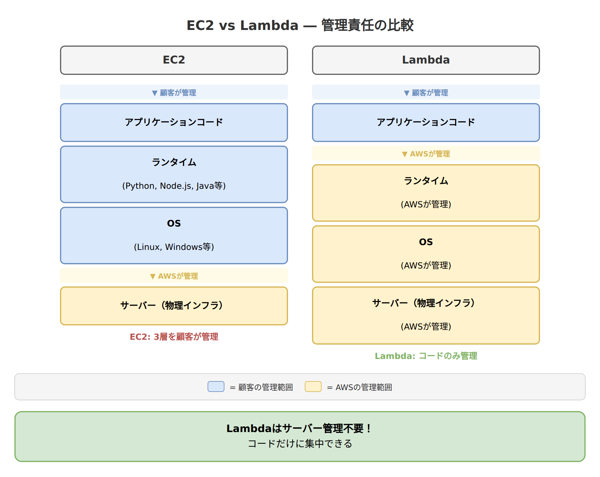
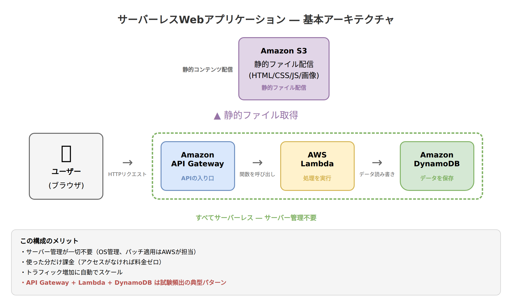
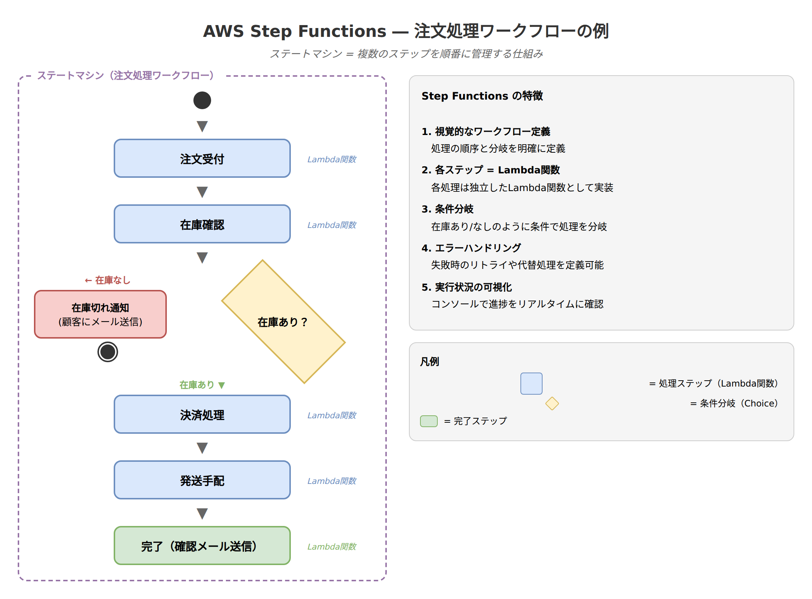

# 第2章　サーバーレスアーキテクチャ ― サーバー管理から解放される仕組み

**対応試験ドメイン**: 第1分野: クラウドのコンセプト（24%）、第3分野: クラウドテクノロジーとサービス（34%）
**推定読了時間**: 30分

---

## この章で学ぶこと

サーバーレスという考え方を理解し、代表的なAWSサービスの役割と使いどころを把握します。

- サーバーレスの正しい意味とEC2との違い
- AWS Lambda の仕組み・制約・課金モデル
- Amazon API Gateway とLambdaの連携パターン
- AWS Fargate によるサーバーレスなコンテナ実行
- AWS Step Functions によるワークフローの概念

---

## 2-1. サーバーレスとは何か

### このセクションで学ぶこと

「サーバーレス」という言葉の正しい意味を理解し、EC2（自分でサーバーを管理する方式）との違いを把握します。

### サーバー管理はなぜ大変なのか

第0章で学んだように、EC2を使えばクラウド上にサーバーを素早く用意できます。しかし、EC2を使う場合でも、次のような管理作業はユーザー自身が行う必要があります。

- OSのセキュリティパッチを定期的に当てる
- サーバーの負荷を監視して、必要に応じてサーバーを増やす（スケーリング）
- サーバーが停止したときの対応を考える
- 使っていない時間もサーバーは動き続けるため、料金が発生する

たとえば、1日に数回しかアクセスされないWebサイトでも、EC2はずっと起動していなければなりません。これは、お客さんが1日3人しか来ないお店に、24時間ずっと店番を置いているようなものです。

### 「サーバーレス」の本当の意味

「サーバーレス」と聞くと「サーバーが存在しない」と思ってしまいがちですが、それは間違いです。サーバーレスの正しい意味は、**サーバーの管理をAWSにすべて任せて、ユーザーはアプリケーションのコードだけに集中できる**ということです。

実際には裏側でサーバーは動いています。ただし、そのサーバーのOS管理、パッチ適用、スケーリング、起動・停止をすべてAWSが自動でやってくれるので、ユーザーは「サーバーの存在を意識しなくてよい」のです。

レストランに例えると、EC2は「キッチンごと借りて自分で料理する」スタイル。食材の仕入れ、調理器具のメンテナンス、厨房の清掃まですべて自分の仕事です。一方、サーバーレスは「出前を注文する」スタイル。料理（＝アプリケーションの動作）だけを受け取れて、キッチンの管理は一切不要です。

### EC2とサーバーレスの責任範囲の違い

EC2とLambda（代表的なサーバーレスサービス）を比べると、管理責任が大きく異なります。

EC2では、物理インフラ以外のほぼすべてをユーザーが管理します。これに対して、Lambdaではユーザーが管理するのはアプリケーションコードだけです。この違いが、サーバーレスの最大のメリットです。

### サーバーレスの3つのメリット

サーバーレスには、大きく3つのメリットがあります。

1つ目は**運用負荷の軽減**です。OS管理やパッチ適用をAWSに任せられるので、開発チームはアプリケーションの改善に集中できます。

2つ目は**コストの最適化**です。サーバーレスでは処理が実行されたときだけ課金されます。誰もアクセスしていない時間には料金がかかりません。EC2のように「サーバーを起動しているだけで料金が発生する」ということがありません。

3つ目は**自動スケーリング**です。アクセスが急増しても、AWSが自動的にリソースを増やして対応してくれます。ユーザーがスケーリングの設定を細かく考える必要がありません。

---

> **試験のポイント**
> - 「サーバーレス = サーバーが存在しない」は**誤り**。正しくは「サーバーの管理をAWSに任せる」
> - EC2はIaaS（インフラの管理はユーザー）、LambdaはFaaS（Function as a Service）に分類される。IaaS（EC2）→ PaaS（Elastic Beanstalk等）→ FaaS（Lambda）→ SaaS と進むほど、AWSの管理範囲が広がる
> - サーバーレスの課金は「使った分だけ」。アイドル時間にコストがかからない

---

## 2-2. AWS Lambda

### このセクションで学ぶこと

AWSのサーバーレスサービスの中心である「AWS Lambda」の仕組み、制約、課金モデルを理解します。

### Lambda とは

AWS Lambda（ラムダ）は、**プログラムのコードをサーバーなしで実行できるサービス**です。「関数」と呼ばれる単位でコードを登録しておくと、何らかの「きっかけ（トリガー）」があったときに、そのコードが自動的に実行されます。

たとえば「S3に画像がアップロードされたら、自動的にサムネイル画像を作成する」「毎日午前9時にデータベースのレポートを生成する」といった処理を、Lambda関数として登録しておくことができます。

### イベント駆動型の仕組み

Lambdaは**イベント駆動型**で動きます。イベント駆動型とは、「何かが起きたら、それに反応して処理が実行される」仕組みのことです。

自動ドアをイメージしてみてください。人が近づくと（イベント発生）、センサーが反応してドアが開きます（処理実行）。誰も通らないときは、ドアは何もしません（待機状態＝課金されない）。Lambda も同じで、トリガーとなるイベントが発生するまでは何も動きません。

代表的なトリガーには以下のようなものがあります。

- Amazon S3にファイルがアップロードされた
- Amazon API Gatewayを通じてHTTPリクエストが来た
- Amazon EventBridge（旧CloudWatch Events）で設定したスケジュール時刻になった
- Amazon DynamoDBのデータが更新された

### Lambda の課金モデル

Lambdaの料金は、**リクエスト数**と**実行時間**の2つで決まります。

リクエスト数は、Lambda関数が呼び出された回数に応じて課金されます。毎月100万リクエストまでは無料枠に含まれます。

実行時間は、関数が実行された時間（ミリ秒単位）と、割り当てたメモリ量の組み合わせで計算されます。課金単位は「GB-秒」で、これは割り当てたメモリ量（GB）× 実行秒数で求められます。メモリを多く割り当てるほど処理は速くなりますが、単価も上がります。

重要なのは、**関数が実行されていないときは一切課金されない**という点です。EC2は起動しているだけで時間課金が発生しますが、Lambdaはリクエストがなければ0円です。

### Lambda の制約

Lambdaは万能ではなく、いくつかの制約があります。試験でもよく問われるポイントです。

最も重要な制約は**実行時間の上限が15分**であることです。15分を超える処理はLambdaでは実行できません。たとえば、大量のデータを何時間もかけて処理するバッチ処理には向いていません。そのような場合は、EC2やFargate（後述）を使うほうが適切です。

メモリの上限は10GBまでです。一時ストレージ（/tmpディレクトリ）は最大10GBまで使えます。

また、Lambda関数がしばらく呼び出されていない場合、最初の呼び出し時に実行環境の準備が必要となり、応答時間が通常より長くなることがあります。これを「コールドスタート」と呼びます。頻繁に呼び出される関数ではあまり気になりませんが、応答速度が重要な場面ではProvisioned Concurrency（プロビジョンド・コンカレンシー）という機能を使って、事前に実行環境を用意しておくことでコールドスタートを回避できます。

これらの制約があるため、Lambdaは「短時間で完了する処理」に最適です。画像のリサイズ、データの変換、通知の送信、APIのバックエンドといった用途に向いています。

### EC2 と Lambda の使い分け

EC2とLambdaは、どちらもコードを実行するサービスですが、向いている場面が異なります。

EC2が向いているのは、24時間365日稼働し続けるWebサーバー、15分以上の長時間処理、OSレベルのカスタマイズが必要な場合、GPUを使った機械学習の学習処理などです。

Lambdaが向いているのは、リクエストに応じて短時間で完了する処理、トラフィックの変動が大きい処理、イベントに反応して自動実行したい処理、マイクロサービスのAPIバックエンドなどです。

---

> **試験のポイント**
> - Lambdaの実行時間上限は**15分**（頻出）
> - 課金は「リクエスト数 + 実行時間」。実行されなければ課金なし
> - 長時間処理にLambdaは不向き → EC2やFargateを使う
> - イベント駆動型 = 何かが起きたら自動的に処理が走る仕組み

---

## 2-3. Amazon API Gateway

### このセクションで学ぶこと

API Gatewayの役割と、Lambdaとの連携パターンを理解します。

### API Gateway とは

Amazon API Gateway（エーピーアイ ゲートウェイ）は、**APIの入り口を作成・管理するサービス**です。

そもそもAPI（Application Programming Interface）とは、アプリケーション同士がデータをやりとりするための「窓口」のことです。たとえば、スマートフォンのアプリが天気情報を表示するとき、裏側では天気予報サービスのAPIに「今日の天気を教えて」とリクエストを送り、結果を受け取っています。

API Gatewayは、この「窓口」の受付係のような役割を果たします。外部からのリクエストを受け付けて、適切なバックエンド（Lambda関数など）に振り分けます。

### API Gateway + Lambda のパターン

API GatewayとLambdaを組み合わせると、サーバーレスなWebアプリケーションやAPIを構築できます。これはサーバーレスアーキテクチャの最も典型的なパターンです。

この構成では、ユーザーがブラウザやアプリからHTTPリクエストを送ると、API Gatewayがそれを受け取り、対応するLambda関数を呼び出します。Lambda関数はDynamoDB（AWSのNoSQLデータベース。詳細は第4章で扱います）などからデータを取得・加工して、結果をユーザーに返します。

この構成のすべてのコンポーネントがサーバーレスであるため、サーバーの管理が一切不要です。トラフィックが増えれば自動的にスケールし、使った分だけ課金されます。

### API Gateway の主な機能

API Gatewayには、単純な「受付係」以上の機能があります。

**スロットリング**は、短時間に大量のリクエストが来た場合にリクエスト数を制限する機能です。急激なアクセス増加からバックエンド（Lambda関数など）を保護します。

**認証・認可**の機能もあります。APIキーやIAM認証、Amazon Cognitoとの連携により、「誰がこのAPIを使えるか」を制御できます。

**REST API と WebSocket API** の両方をサポートしています。REST APIは手紙のやりとりのように、1回リクエストを送ると1回レスポンスが返ってくる通信に使います。WebSocket APIは電話のように、接続をつなぎっぱなしにしてリアルタイムに双方向のやりとりをする通信（チャットなど）に使います。

なお、API Gatewayには REST API のほかに HTTP API という種類もあります。HTTP APIはREST APIよりもシンプルで低コストですが、一部の高度な機能（APIキーの管理やリクエスト検証など）はREST APIのみで利用可能です。シンプルなAPI構築にはHTTP APIがコスト面で有利です。

---

> **試験のポイント**
> - API Gateway + Lambda = サーバーレスの典型パターン（頻出）
> - API Gateway は API の「入り口」を管理するサービス
> - スロットリング = リクエスト数の制限（バックエンドの保護）
> - API Gateway 自体もサーバーレスサービス

---

## 2-4. AWS Fargate

### このセクションで学ぶこと

コンテナをサーバーレスで実行する「AWS Fargate」の位置づけと、EC2起動タイプとの違いを理解します。

### コンテナとは

Fargateを理解するためには、まず「コンテナ」を知る必要があります。

ソフトウェア開発では「自分のパソコンでは動くのに、サーバーに持って行くと動かない」という問題がよく起こります。これは、パソコンとサーバーで環境（入っている部品や設定）が微妙に異なるためです。コンテナはこの問題を解決します。

コンテナとは、アプリケーションとその動作に必要なもの（ライブラリ（プログラムが動くために必要な部品）、設定ファイルなど）を一つにまとめた「箱」のようなものです。引っ越しのときに、荷物をダンボール箱にきれいに詰めると、どこに持って行っても同じように中身を取り出せますよね。コンテナもそれと同じで、どの環境に持って行っても同じように動作します。

AWSでコンテナを動かすサービスとして、Amazon ECS（Elastic Container Service）やAmazon EKS（Elastic Kubernetes Service）があります。これらのサービスでコンテナを動かすとき、「コンテナをどこで実行するか」を選ぶ必要があります。その選択肢の1つがFargateです。

### Fargate = サーバーレスなコンテナ実行環境

AWS Fargateは、**コンテナを動かすためのサーバー（インスタンス）を管理しなくてよい**実行環境です。

ECSやEKSでコンテナを動かす方法は、大きく2つあります。

**EC2起動タイプ**では、コンテナを動かすためのEC2インスタンスをユーザー自身が管理します。どのサイズのEC2を何台使うか、OSのパッチをいつ当てるか、サーバーの負荷に応じてインスタンスを増やすかどうかなど、すべて自分で決めて管理する必要があります。

**Fargate起動タイプ**では、コンテナを動かすためのサーバーの管理がすべてAWSに任されます。ユーザーは「このコンテナを動かしたい」「CPUとメモリはこれくらい必要」と指定するだけでよく、その裏側のサーバーについては一切気にする必要がありません。

つまり、Fargateは「コンテナ版のサーバーレス」と考えることができます。Lambdaが「関数のサーバーレス実行」であるのに対して、Fargateは「コンテナのサーバーレス実行」です。

### Lambda と Fargate の使い分け

Lambdaは15分以内の短い処理に向いていますが、Fargateにはそのような実行時間の制限がありません。15分を超える処理や、コンテナとして既にパッケージされたアプリケーションを動かしたい場合は、Fargateが適しています。

> Fargateの詳しい仕組み、EC2起動タイプとの責任範囲の比較、具体的なユースケースについては第8章で詳しく扱います。この章では「Fargate = サーバーレスにコンテナを実行できる」という位置づけを押さえておけば十分です。

---

> **試験のポイント**
> - Fargate = 「サーバーレスなコンテナ実行環境」
> - ECS/EKSの起動タイプとして「EC2起動タイプ」と「Fargate起動タイプ」がある
> - EC2起動タイプ: インスタンスの管理はユーザー。Fargate起動タイプ: インスタンスの管理はAWS
> - Lambda（15分制限あり）で対応できない長時間処理にはFargateが使える

---

## 2-5. AWS Step Functions（概要）

### このセクションで学ぶこと

複数のサービスを組み合わせてワークフローを定義・実行する「AWS Step Functions」の概念を理解します。

### なぜワークフローの管理が必要なのか

Lambda関数は1つの関数で1つの処理を行います。しかし、実際のビジネスでは複数の処理を順番に、あるいは条件に応じて実行する必要があります。

たとえば、ECサイトの注文処理を考えてみましょう。「注文を受け付ける」→「在庫を確認する」→「在庫があれば決済処理をする」→「発送を手配する」→「確認メールを送る」という一連の流れがあります。これを個々のLambda関数で実現すると、「どの関数をどの順番で呼ぶか」「途中でエラーが起きたらどうするか」を管理するのが大変になります。

### Step Functions とは

AWS Step Functionsは、**複数のAWSサービス（Lambda関数など）を組み合わせたワークフロー（処理の流れ）を視覚的に定義・実行・管理できるサービス**です。

ワークフローは「ステートマシン」と呼ばれる形式で定義します。ステートマシンとは、「状態（ステート）」と「状態の遷移（次にどこに進むか）」を定義した仕組みです。

信号機をイメージしてみてください。「青→黄→赤→青→...」と、決まったルールに従って状態が変わっていきます。Step Functionsのステートマシンも同じように、「この処理が終わったら次はこの処理」「この条件ならこちらの処理に分岐」というルールを定義します。

上の図のように、Lambda関数を順番に実行したり、条件によって処理を分岐させたりする流れを、視覚的にわかりやすく定義できます。

### Step Functions のメリット

Step Functionsを使うと、複数のサービスを「オーケストレーション（統合管理・連携）」できます。オーケストレーションとは、オーケストラの指揮者のように、複数の演奏者（サービス）をまとめて一つの曲（ワークフロー）を演奏させるイメージです。

途中の処理が失敗した場合のリトライ（再試行）やエラーハンドリング（エラー時の対応）も組み込めます。また、ワークフローの実行状況をAWSマネジメントコンソールで視覚的に確認できるため、「今どこまで処理が進んでいるか」が一目でわかります。

なお、Step Functionsには Standardワークフロー（長時間実行向け・最大1年間）と Expressワークフロー（短時間・高頻度の処理向け）の2種類があります。用途に応じて使い分けます。

> Step Functionsのステートマシンの詳しい設計方法、ワークフローパターン、他のサービスとの連携については第6章で詳しく扱います。この章では「複数のサービスをつなげて一連の処理を自動化するサービス」という概念を理解しておけば十分です。

---

> **試験のポイント**
> - Step Functions = 複数のサービスを組み合わせた**ワークフローを管理するサービス**
> - 「オーケストレーション」というキーワードが出たらStep Functionsを連想する
> - Lambda単体では難しい「複数ステップの処理の連携」を実現する
> - ステートマシンによってワークフローを定義する

---

## 章末確認問題

### 問題1

「サーバーレス」の説明として正しいものはどれですか？

- **A.** サーバーが物理的に存在しない
- **B.** サーバーの管理をAWSに任せ、ユーザーはコードに集中できる
- **C.** サーバーの料金が無料になる
- **D.** サーバーをオンプレミスで運用する方式のこと

解答・解説

**解答: B**

解説: サーバーレスとは「サーバーが存在しない」のではなく、「サーバーの管理をAWSに任せて、ユーザーはアプリケーションコードだけに集中できる」という意味です。実際には裏側でサーバーは動いています。

---

### 問題2

AWS Lambdaの実行時間の上限はどれですか？

- **A.** 5分
- **B.** 10分
- **C.** 15分
- **D.** 60分

解答・解説

**解答: C**

解説: AWS Lambdaの1回の実行時間の上限は**15分**です。これを超える長時間処理にはLambdaは使えません。EC2やFargateなど、実行時間に制限のないサービスを使う必要があります。

---

### 問題3

AWS Lambdaの課金モデルの説明として正しいものはどれですか？

- **A.** 月額固定料金で利用できる
- **B.** リクエスト数と実行時間に基づいて課金される
- **C.** EC2と同様に、起動している時間に対して課金される
- **D.** データ転送量のみで課金される

解答・解説

**解答: B**

解説: Lambdaは**リクエスト数**（関数が呼び出された回数）と**実行時間**（関数が実行されたミリ秒数 × メモリ量）で課金されます。関数が実行されていないときは課金されません。

---

### 問題4

サーバーレスWebアプリケーションの典型的な構成として最も適切なものはどれですか？

- **A.** EC2 → RDS
- **B.** API Gateway → Lambda → DynamoDB
- **C.** CloudFront → S3
- **D.** ELB → EC2 → ElastiCache

解答・解説

**解答: B**

解説: **API Gateway → Lambda → DynamoDB**は、サーバーレスWebアプリケーションの最も典型的なパターンです。API Gatewayがリクエストの入口、Lambdaがビジネスロジックの処理、DynamoDBがデータの保存を担当します。すべてサーバーレスサービスで構成されています。

---

### 問題5

以下のうち、サーバーレスサービスに該当するものはどれですか？

- **A.** Amazon EC2
- **B.** Amazon RDS
- **C.** AWS Lambda
- **D.** Amazon ElastiCache

解答・解説

**解答: C**

解説: **AWS Lambda**はサーバーレスサービスです。EC2は仮想サーバーそのものであり、RDSやElastiCacheはマネージドサービスですがインスタンスの管理（サイズ選択など）はユーザーが行うため、厳密にはサーバーレスとは呼びません。

---

### 問題6

AWS Fargateの説明として正しいものはどれですか？

- **A.** サーバーレスで仮想マシン（EC2）を実行するサービス
- **B.** サーバーレスでコンテナを実行できる環境
- **C.** コンテナイメージを保存するリポジトリサービス
- **D.** コンテナの監視専用サービス

解答・解説

**解答: B**

解説: AWS Fargateは**サーバーレスでコンテナを実行できる環境**です。ECSやEKSと組み合わせて使います。EC2起動タイプとは異なり、コンテナを動かすためのサーバー（インスタンス）の管理が不要です。

---

### 問題7

大量のデータを2時間かけて処理するバッチ処理を実行する場合、最も適切なサービスはどれですか？

- **A.** AWS Lambda
- **B.** Amazon API Gateway
- **C.** Amazon EC2 または AWS Fargate
- **D.** AWS Step Functions

解答・解説

**解答: C**

解説: AWS Lambdaには実行時間15分の上限があるため、2時間のバッチ処理には使えません。**EC2**または**Fargate**のように、実行時間に制限のないサービスを使います。API Gatewayはリクエストの入口を管理するサービスであり、Step Functionsはワークフローを管理するサービスです。

---

### 問題8

AWS Step Functions の主な役割はどれですか？

- **A.** 単一のLambda関数の実行時間を延長する
- **B.** 複数のAWSサービスを組み合わせたワークフローを定義・管理する
- **C.** EC2インスタンスの自動スケーリングを設定する
- **D.** データベースのバックアップを自動化する

解答・解説

**解答: B**

解説: AWS Step Functionsは**複数のAWSサービス（Lambda関数など）を組み合わせたワークフローを定義・実行・管理する**サービスです。ステートマシンによって処理の順序や分岐を定義し、複数のサービスを「オーケストレーション（統合管理）」できます。

